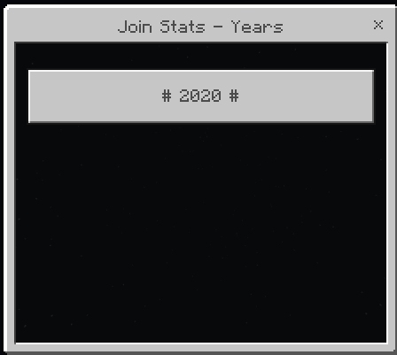
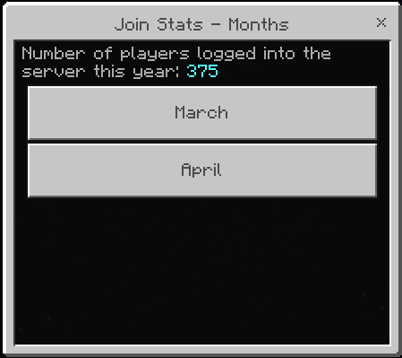
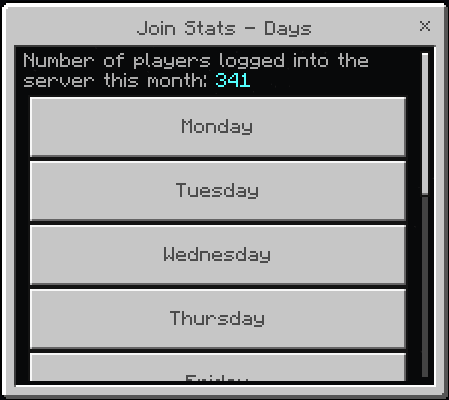
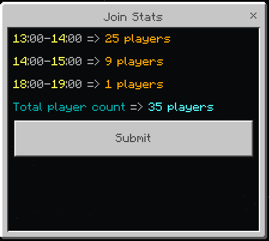

# Join Stats
This PocketMine-MP plugin **stores the number of players logged in hourly, daily, weekly, monthly and yearly. 
This helps your server to keep track of your activity.** If you want to use UI Panel, you need [FormAPI](https://github.com/jojoe77777/FormAPI).

| HitCount | License |
|--------|----------|
|| 

### Commands & Permissions
The main command: `/joinstats` or `/js`

Permission required for main command: `join.stats.commands`

| __Sub commands__ | __Extra args__ | __Description__ |
|-------------|-------------|------------|
| hour         | -     |  Find out how many people entered the server at this hour. |
| day         | -     |  Find out how many people entered the server today. |
| week         | -     |  Find out how many people entered the server last 1 week. |
| month         | -     |  Find out how many people entered the server last 1 month. |
| year         | -     |  Find out how many people entered the server last 1 year. |
| date         | day month year hour(optional)     |  Learn user logins with date. |
| -         | -    |  Open the UI panel. |

### Images
 
 

### TODO 
 - Increase and drop statistics
 - Multi language
 - Number formatting
 
### Contributing
 1. Fork it (<https://github.com/eren5960/joinstats/fork>)
 2. Create your feature branch (`git checkout -b feature/fooBar`)
 3. Commit your changes (`git commit -am 'Add some fooBar'`)
 4. Push to the branch (`git push origin feature/fooBar`)
 5. Create a new Pull Request